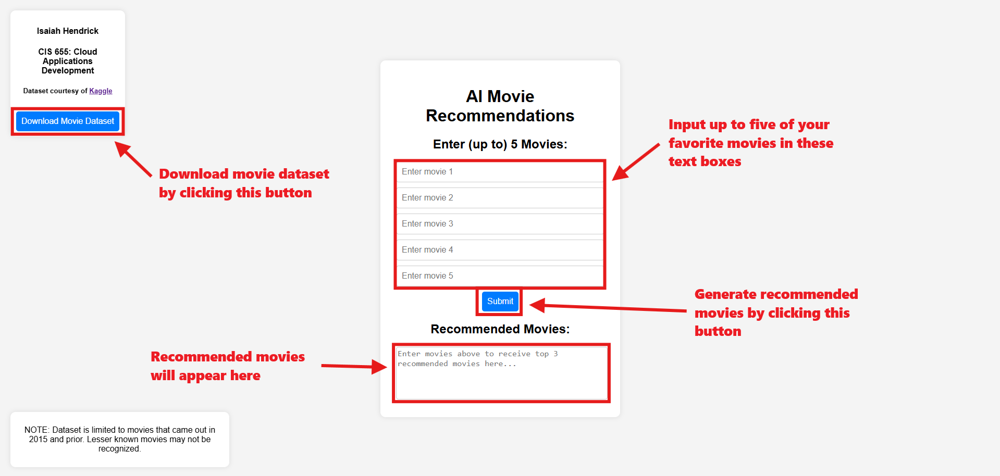

<!-- HEADER -->
<div align="center">
  <p style="font-size: 40px;"><b>gcloud-movie-picker</b></p>
  <p style="font-size: 18px;">Need help finding a movie to watch?</p>
  <p>
    <a href="https://hendrick-cis655-finalproject.ue.r.appspot.com/">
      
    </a>
    <a href="https://www.youtube.com/">
      
    </a>
  </p>
</div>


<!-- TABLE OF CONTENTS -->
## Table of Contents
<ol>
  <li>
    <a href="#about-the-project">About The Project</a>
  </li>
  <li>
    <a href="#instructions">Instructions</a>
    <ul>
      <li><a href="#cloud-storage">Cloud Storage</a></li>
      <li><a href="#big-query">Big Query</a></li>
      <li><a href="#vertex-ai">Vertex AI</a></li>
      <li><a href="#cloud-run">Cloud Run</a></li>
      <li><a href="#app-engine">App Engine</a></li>
    </ul>
  </li>
  <li><a href="#usage">Usage</a></li>
</ol>


<!-- ABOUT THE PROJECT -->
## About The Project

I have always loved watching movies, but always seem to have trouble deciding which film to watch, or sometimes even simply finding a film that peaks my interest. This tool implements a machine learning model, trained with user ratings using Vertex AI, to generate recommended movies based on those provided by a user.


<!-- GETTING STARTED -->
## Instructions

This project implements Google Cloud services, specifically Cloud Storage, Big Query, Vertex AI, Cloud Run, and App Engine. For recreation purposes, this is a brief description of how each was implemented.

This also means a Google Cloud account is required, since all instructions are meant for use within the Cloud Console (using these services may incur charges to your account).

### Cloud Storage

The data needed for training the Vertex AI model was stored within Cloud Storage, which was done with the following commands (make sure you are in the same directory as the .csv files when executing):

```
gcloud storage buckets create gs://{PROJECT_ID}-recommended-movies-bucket
```
```
gcloud storage cp movies.csv ratings.csv gs://{PROJECT_ID}-recommended-movies-bucket
```

The datasets were initially downloaded from [Kaggle - MovieLens 20M Dataset](https://www.kaggle.com/datasets/grouplens/movielens-20m-dataset), and uploaded to the Cloud Console. For convenience, the files are also stored in this repository.

> **NOTE:** The web application also makes a call directly to Cloud Storage, allowing the user to download the movie dataset. In order for this call to work properly, the bucket permissions must be updated. In the permissions tab of the recommended-movies-bucket details within Cloud Console, grant the "Storage Object Viewer" role to the principal "allUsers". If creating your own bucket, you will also need to change the URL within the "downloadDataset()" function in [index.html](web-app/public/index.html).

### Big Query

Big Query was used for preparing the movie and ratings data when training the Vertex AI model, as well as finding the movies within the dataset that most closely match the user's input (in the case of misspelling/ ommission of part of title). 

Create a Big Query dataset with the command:

```
bq mk bq_movies
```

To load the movies and ratings data into the Big Query datasets, use the following commands:

```
bq load --skip_leading_rows=1 bq_movies.movies gs://{PROJECT_ID}-recommended-movies-dataset/movies.csv movieId:integer,title:string,genres:string
```

```
bq load --skip_leading_rows=1 bq_movies.ratings gs://{PROJECT_ID}-recommended-movies-dataset/ratings.csv userId:integer,movieId:integer,rating:float,time:timestamp
```

To train the Vertex AI model, the format of the datasets must be reorganized to work properly. Use the following scripts to prepare the data:

```
bq mk --project_id={PROJECT_ID} --use_legacy_sql=false --view '
 SELECT
   CAST(movieId AS string) AS id,
   SUBSTR(title, 0, 128) AS title,
   SPLIT(genres, "|") AS categories
 FROM `{PROJECT_ID}.bq_movies.movies`' bq_movies.products
```

```
bq mk --project_id={PROJECT_ID} --use_legacy_sql=false --view '
 WITH t AS (
   SELECT
     MIN(UNIX_SECONDS(time)) AS old_start,
     MAX(UNIX_SECONDS(time)) AS old_end,
     UNIX_SECONDS(TIMESTAMP_SUB(
       CURRENT_TIMESTAMP(), INTERVAL 90 DAY)) AS new_start,
     UNIX_SECONDS(CURRENT_TIMESTAMP()) AS new_end
   FROM `{PROJECT_ID}.bq_movies.ratings`)
 SELECT
   CAST(userId AS STRING) AS visitorId,
   "detail-page-view" AS eventType,
   FORMAT_TIMESTAMP(
     "%Y-%m-%dT%X%Ez",
     TIMESTAMP_SECONDS(CAST(
       (t.new_start + (UNIX_SECONDS(time) - t.old_start) *
         (t.new_end - t.new_start) / (t.old_end - t.old_start))
     AS int64))) AS eventTime,
   [STRUCT(STRUCT(movieId AS id) AS product)] AS productDetails,
 FROM `{PROJECT_ID}.bq_movies.ratings`, t
 WHERE rating >= 4' bq_movies.user_events
```

### Vertex AI

This [guide](https://cloud.google.com/retail/docs/movie-rec-tutorial) from Google was used to assist in the creation and training of the Vertex AI model. The created model is specifically designed for use in commerce, recommending "products" (movies in this case) to users based on previous "user_events" (movie ratings in this case). In order to upload data and train the model, the "Vertex AI Search for Commerce" API must be enabled through Cloud Console.

Both the "products" and "user_events" must be loaded in as data in order to train the model. Within the "Search for Commerce" page in the Cloud Console, import both datasets from Big Query. After both imports have completed (this may take a couple hours), a model can be created and trained with the options "Others you may like" and "Click-through rate (CTR)".

> **Note:** The model takes approximately two days to train using the given ratings dataset. Luckily I was responsible and started this project early instead of procrastinating it until the last second, so this was not an issue :)

### Cloud Run

A Cloud Run function was developed using Python to invoke the Vertex AI model and generate predicted movies using input from the user. The model identifies movies by ID, not title, so the program searches the database for the closest title match given the user input using Big Query and invokes the model with the associated ID. The "google.cloud" API library must be imported in order for this function to work.

To deploy this function to Cloud Run, use the command:

```
gcloud functions deploy movie_recommender --gen2 --region=us-east1 --runtime=python39 --source=. --entry-point=http_movie_recommender --trigger-http
```

Use a cURL command to ensure the function is working properly, the response should include the recommended movies in JSON format (make sure to replace {GENERATED_CLOUD_RUN_URL} with the URL generated by the deploy command). Feel free to edit the input movies to see different reponses. 

```
curl -X POST {GENERATED_CLOUD_RUN_URL} -H "Content-Type: application/json" -d '{"movies":["Inception","The Dark Knight","Shrek"]}'
```

### App Engine

App Engine was used for hosting the web application. NodeJS and HTML were used to develop the application; make sure you install npm before trying to run the application:

```
npm install
```

Make sure that the CLOUD_RUN_URL constant is correctly defined within [app.js](web-app/app.js). For testing purposes, the web server can be ran locally to view the effect of any changes quickly using this command (make sure to run within the web-app subdirectory):

```
npm start
```

For deploying the application to App Engine, use the command (make sure to run within the web-app subdirectory):

```
gcloud app deploy
```

The application should now be ready to use! Access using the URL generated from the previous command.


<!-- USAGE EXAMPLES -->
## Usage

The application itself should be self explanatory. The user has the option to input up to five of their movies, and clicking "Submit" will generate their top three recommended movies based on a Vertex AI model. It is important to note that that dataset being used is older and will only recognize movies released in 2015 or earlier.

The user also has the option of downloading the movie dataset (in the form of a .txt file) by clicking "Download Dataset." This dataset includes the list of movies and the genres associated with each.

